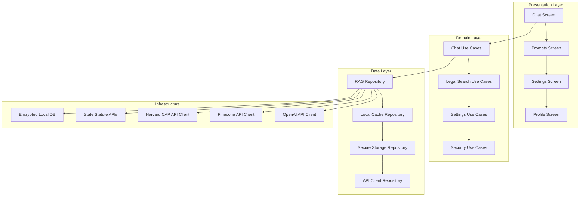
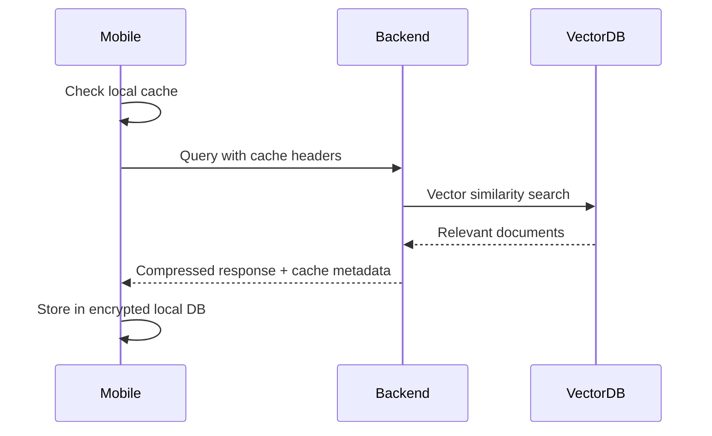
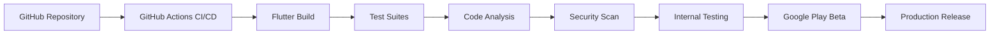

# Pocket Lawyer Android App Architecture Design

## Executive Summary

This document outlines the comprehensive architecture for converting the Pocket Lawyer web application into a high-performance Android mobile application. The design leverages Flutter for cross-platform development, maintains all core features from the web version, and introduces mobile-specific optimizations for an exceptional user experience.

## Current Web App Analysis

### Core Features Identified:
- **AI-powered chat interface** with GPT-4o-mini integration
- **State-specific legal information retrieval** using RAG (Retrieval-Augmented Generation)
- **Multi-source data integration**: Harvard CAP API, state statute scrapers, Pinecone vector database
- **Citation system** with specific legal references
- **Confidence scoring** for response reliability
- **Expert legal prompts screen** organized by categories (Employment, Real Estate, Criminal/Traffic, Family/Personal)
- **Settings screen** for API key configuration and profile management
- **End-to-end encryption** with AES-256 and zero-knowledge architecture
- **HIPAA-compliant** data handling with attorney-client privilege protection

### Technical Architecture (Web):
- Frontend: HTML/CSS/JavaScript with Tailwind CSS and Marked.js
- Security: CryptoJS for AES-256 encryption, localStorage for encrypted API keys
- Data Flow: User Query → Vector Search → Document Retrieval → Context Assembly → AI Generation → Citation Validation → Encrypted Response
- RAG Pipeline: Query embedding → Similarity search with state filter → Contextual response generation

## Proposed Android App Architecture

### Technology Stack
- **Framework**: Flutter 3.24+ (Dart)
- **State Management**: Riverpod for reactive state management
- **Networking**: Dio for HTTP client with advanced features
- **Local Storage**: Hive for encrypted local database
- **Security**: Flutter Secure Storage + Pointy Castle for cryptography
- **Background Tasks**: WorkManager for offline sync
- **Biometric Authentication**: local_auth for device security integration
- **Minimum Android Version**: API 24 (Android 7.0)

### App Architecture Pattern
```
MVVM (Model-View-ViewModel) with Clean Architecture layers:
├── Presentation Layer (Flutter UI)
├── Domain Layer (Business Logic)
├── Data Layer (Repositories & Data Sources)
└── Infrastructure Layer (External APIs & Storage)
```

### Component Structure



## Backend Integration Strategy

### API Architecture
The mobile app will integrate with the existing Python RAG backend through optimized REST APIs:

#### Core Endpoints:
- `POST /api/v1/chat/query` - Main RAG query endpoint
- `GET /api/v1/states/{state}/prompts` - State-specific prompt templates
- `POST /api/v1/auth/validate-keys` - API key validation
- `GET /api/v1/legal/{citation}` - Citation lookup
- `POST /api/v1/sync/legal-data` - Background legal data sync

#### Request/Response Optimization:
- **Compression**: GZIP for large legal text responses
- **Pagination**: Chunked responses for long legal documents
- **Caching Headers**: ETag and Last-Modified for efficient caching
- **Rate Limiting**: Client-side request throttling

### Data Synchronization Strategy



#### Offline Capabilities:
- **Legal Document Cache**: Store recently accessed statutes/cases locally
- **Prompt Templates**: Cache all prompt categories offline
- **Incremental Sync**: Background sync of legal database updates
- **Conflict Resolution**: Server-side timestamp-based conflict resolution

## Security Architecture

### Mobile-Specific Security Enhancements:
- **Biometric Authentication**: Fingerprint/Face ID for app access
- **App Lock**: Automatic lock after inactivity
- **Secure Enclave**: Use Android Keystore for key storage
- **Certificate Pinning**: SSL pinning for API communications
- **Root Detection**: Basic root/jailbreak detection
- **Data Encryption**: SQLCipher for local database encryption

### Data Protection Strategy:
```
User Data Flow:
Input → AES-256 Encryption → Secure Storage → Transmission (TLS 1.3) → Backend Processing → Encrypted Response
```

### Compliance Considerations:
- **HIPAA Compliance**: Encrypted storage of sensitive legal queries
- **Attorney-Client Privilege**: Zero-knowledge processing guarantee
- **Data Retention**: Automatic deletion of cached data after 30 days
- **Audit Logging**: Local tamper-proof logs of legal interactions

## UI/UX Mobile Adaptations

### Screen Hierarchy:
1. **Splash Screen** with biometric authentication
2. **Main Chat Interface** (primary screen)
3. **Prompts Library** (expandable categories)
4. **Settings & Configuration**
5. **Legal Disclaimer & About**

### Mobile-Specific Features:
- **Gesture Navigation**: Swipe gestures for screen switching
- **Voice Input**: Speech-to-text for query input
- **Haptic Feedback**: Vibration for user interactions
- **Dark Mode**: System-aware theme switching
- **Accessibility**: Screen reader support and high contrast mode

### Performance Optimizations:
- **Lazy Loading**: Progressive loading of legal documents
- **Image Optimization**: WebP format for any visual citations
- **Memory Management**: Automatic cleanup of unused cached data
- **Battery Optimization**: Background sync scheduling
- **Network Awareness**: Adaptive quality based on connection type

## Build and Deployment Strategy

### Development Pipeline:


### Build Configuration:
- **Build Variants**: Debug, Profile, Release
- **Flavor Configuration**: Free/Pro versions
- **Signing**: Automated signing with secure key storage
- **Bundle Optimization**: APK/AAB with resource shrinking

### Deployment Strategy:
- **Staged Rollout**: 10% → 50% → 100% user rollout
- **Crash Reporting**: Firebase Crashlytics integration
- **Analytics**: Firebase Analytics for usage tracking
- **A/B Testing**: Firebase Remote Config for feature flags

## Implementation Roadmap

### Phase 1: Foundation (Weeks 1-2)
- Flutter project setup with clean architecture
- Basic UI scaffolding with navigation
- Local storage and encryption setup
- API client infrastructure

### Phase 2: Core Features (Weeks 3-5)
- Chat interface with real-time messaging
- RAG integration with backend APIs
- Prompt library implementation
- Settings screen with API configuration

### Phase 3: Mobile Optimization (Weeks 6-7)
- Offline capabilities and caching
- Biometric authentication
- Performance optimizations
- Accessibility features

### Phase 4: Testing & Deployment (Weeks 8-9)
- Comprehensive testing (unit, integration, E2E)
- Security audit and penetration testing
- Google Play Store preparation
- Production deployment with monitoring

## Risk Assessment & Mitigation

### Technical Risks:
- **API Rate Limits**: Implement intelligent caching and request queuing
- **Large Legal Documents**: Progressive loading and compression
- **Device Compatibility**: Extensive device testing across Android versions
- **Security Vulnerabilities**: Regular security audits and dependency updates

### Performance Risks:
- **Slow Initial Load**: Implement lazy loading and background prefetching
- **High Memory Usage**: Memory profiling and optimization
- **Battery Drain**: Background task optimization and user controls

### Business Risks:
- **API Cost Overruns**: Usage monitoring and cost controls
- **Legal Compliance**: Regular legal review of features and disclaimers
- **User Privacy**: Transparent privacy policy and data handling practices

## Success Metrics

### Technical KPIs:
- App startup time < 2 seconds
- Query response time < 3 seconds (with cache)
- Offline functionality for 80% of common queries
- Crash rate < 0.1%
- Battery usage < 5% per hour of active use

### User Experience KPIs:
- User retention > 70% after 30 days
- Average session duration > 5 minutes
- Task completion rate > 85% for common legal queries
- Accessibility compliance score > 95%

This architecture provides a solid foundation for a high-performance, secure, and user-friendly Android application that maintains all the powerful features of the web version while optimizing for mobile usage patterns and constraints.